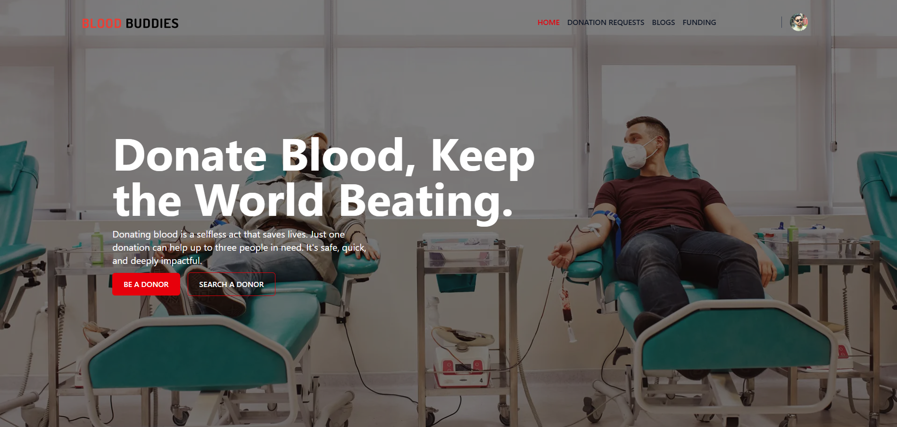

BloodBuddies

A simple, clean platform that connects blood donors and recipients — request, manage, and track donations quickly and safely.

🔎 Project Overview

BloodBuddies is a web application that streamlines blood donation requests and donor matching. Recipients can create requests with required blood group and location details, and donors can view and respond to requests. The app includes user authentication, a dashboard for managing requests, and dynamic district/upazila selection for location-specific matching.

[🌐 Live Website](https://blood-buddies.netlify.app/)

🖼 Screenshot

🧰 Technologies Used

Frontend: React, TailwindCSS, DaisyUI, Framer Motion, React Router

HTTP & State: Axios, react-hook-form (optional)

Backend: Node.js, Express

Database: MongoDB (Mongoose)

Auth & Security: JSON Web Tokens (JWT), bcrypt

✨ Core Features

- Create and manage blood donation requests (recipient side)
- Browse and respond to open donation requests (donor side)
- User authentication (register / login) with JWT
- Dashboard for users to view their requests and responses
- Dashboard for Admin and Volunteer to maintain users requests and responses
- Search and filter by blood group, district, and urgency
- Real-time-ish UI improvements (animations with Framer Motion)
- Mobile-responsive UI built with TailwindCSS + DaisyUI

📦 Dependencies
Frontend: react, react-dom, react-router-dom, axios, tailwindcss, daisyui, framer-motion, react-icons

Backend: express, mongoose, cors, dotenv, bcrypt, jsonwebtoken, nodemon (dev)
---
🚀 Run Locally — Step by Step
1. Clone the repository
git clone [Clone](https://github.com/hosenrabby/bloodBuddies-client.git)
cd bloodBuddies
2. Setup the backend (server)
cd server
npm install
cp .env.example .env
# Add MongoDB URI and JWT secret to .env
npm run dev
Example .env file
PORT=5000
MONGODB_URI=mongodb+srv://<user>:<pass>@cluster.mongodb.net/taketask
JWT_SECRET=your_jwt_secret
CLIENT_URL=http://localhost:3000
npm run dev
📬 Contact

Reach me at: hosenrabby.dev@gmail.com
